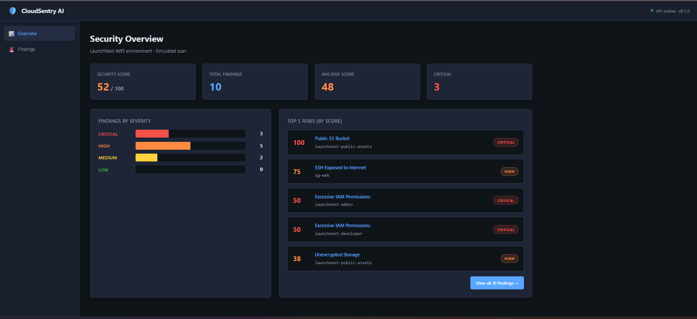
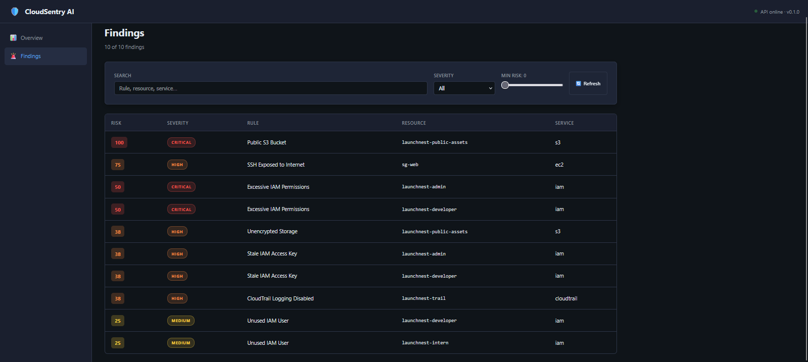
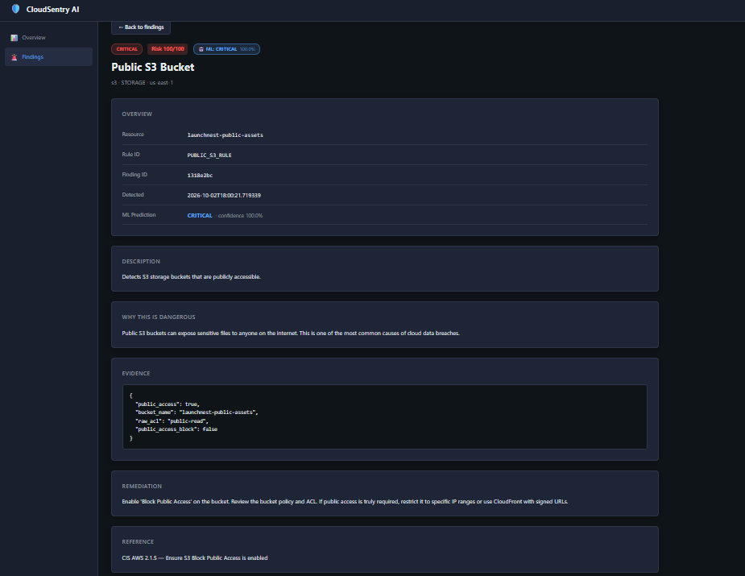
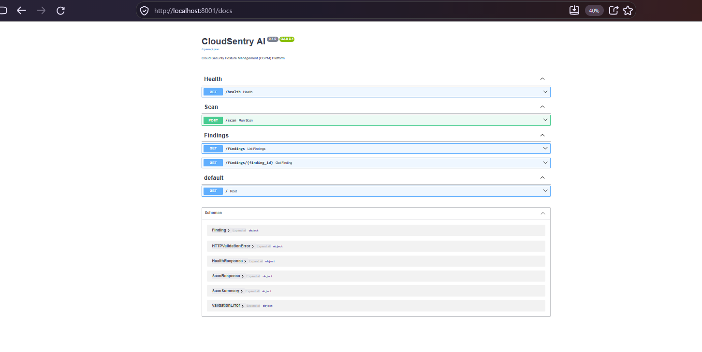
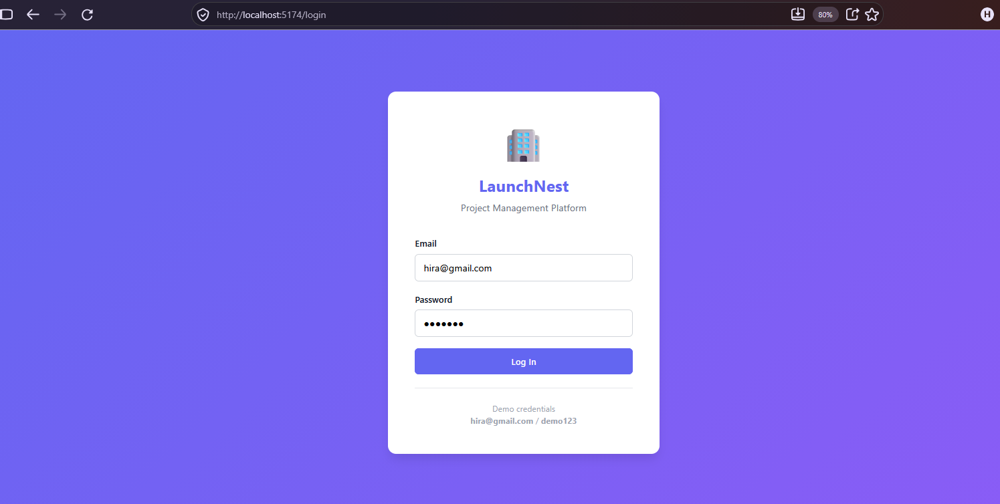
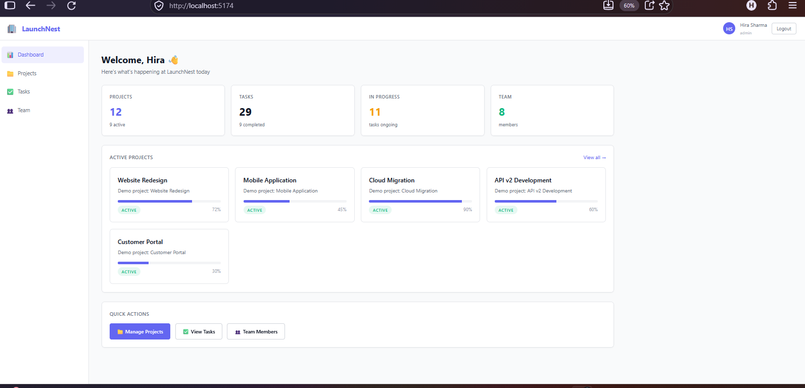
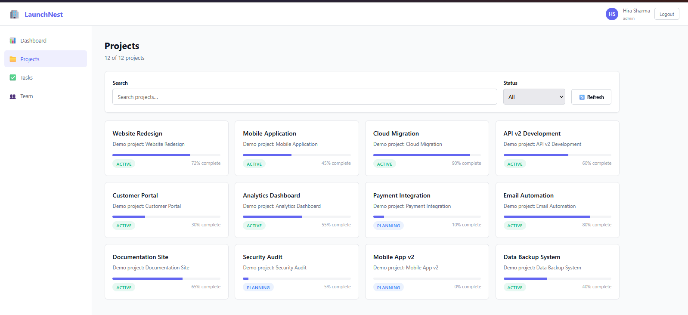
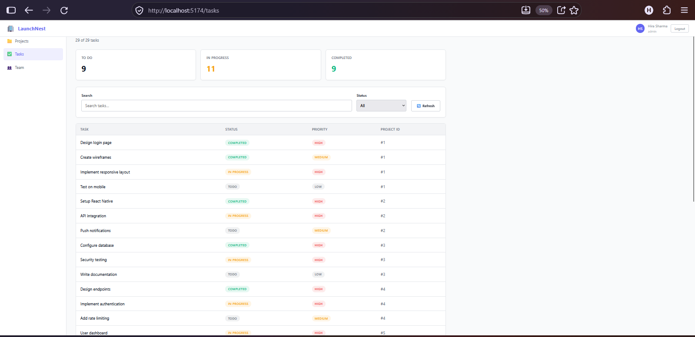
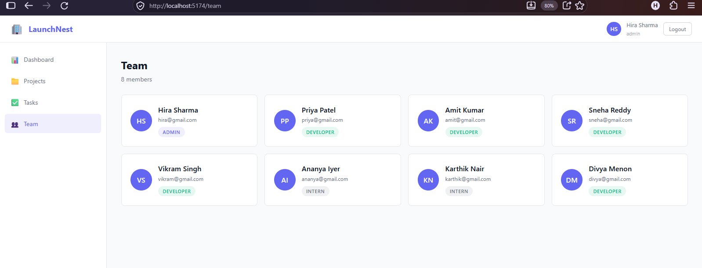
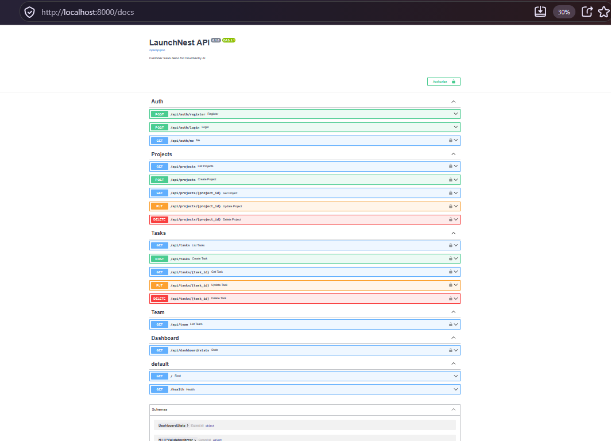

# 🛡️ CloudSentry AI

> **A lightweight Cloud Security Posture Management (CSPM) platform for small SaaS companies.**


---

## 🌐 Live Demo

**🔗 One link:** [https://cloudsentry-app.onrender.com/hub](https://cloudsentry-app.onrender.com/hub)

| Service | Live URL |
|---------|----------|
| 🛡️ Security Dashboard | https://cloudsentry-app.onrender.com |
| 🏢 Customer SaaS | https://launchnest-app.onrender.com |
| ⚙️ Security API Docs | https://cloudsentry-backend.onrender.com/docs |
| 🔐 Customer API Docs | https://launchnest-backend-xtgl.onrender.com/docs |

**Demo Login:** `hira@gmail.com` / `demo123`

> ⚠️ Deployed on Render's free tier — first request may take 30–60 seconds to wake up.

---

## 📌 What Is This?

CloudSentry AI is a **Cloud Security Posture Management** platform that:

- 🔍 **Discovers** AWS cloud resources (S3, IAM, EC2, RDS, CloudTrail)
- ⚙️ **Collects** security-relevant configuration
- 📏 **Evaluates** 8 deterministic security rules aligned with CIS AWS Benchmarks
- 🎯 **Prioritizes** findings using a transparent risk engine + ML
- 📊 **Displays** actionable findings with evidence and remediation
- 🏢 **Demonstrates** the platform against a realistic demo customer (**LaunchNest**)

---

## 🏢 Demo Customer: LaunchNest

To make the demo realistic, we built **LaunchNest** — a fictional small SaaS project-management platform:

| Attribute | Value |
|-----------|-------|
| **Type** | Small SaaS / Cloud Startup |
| **Size** | 15–30 employees |
| **Cloud** | AWS |
| **Product** | Online project-management platform |
| **Security Team** | None (no dedicated cloud-security engineer) |
| **Demo Login** | `hira@gmail.com` / `demo123` |

CloudSentry AI scans LaunchNest's **simulated AWS environment** and reports security issues.

---

## 🏗️ Architecture

```text
                    CLOUDSENTRY AI ECOSYSTEM
                           │
             ┌─────────────┴─────────────┐
             │                           │
             ▼                           ▼
      🏢 LaunchNest                 🛡️ CloudSentry AI
      Customer SaaS                Security Platform
      (React :5174 + FastAPI :8000) (React :5173 + FastAPI :8001)
             │                           │
             └─────────────┬─────────────┘
                           │
                           ▼
                  🌩️ Simulated AWS
                  (13 resources, 7 misconfigured)
                           │
                           ▼
                  ┌─────────────────┐
                  │  8 Security     │
                  │  Rules          │
                  └────────┬────────┘
                           │
                           ▼
                  ┌─────────────────┐
                  │  Risk Engine    │
                  │  (0-100 scores) │
                  └────────┬────────┘
                           │
                           ▼
                  ┌─────────────────┐
                  │  ML Predictor   │
                  │  (XGBoost)      │
                  └────────┬────────┘
                           │
                           ▼
                  ┌─────────────────┐
                  │  10 Findings    │
                  │  Dashboard      │
                  └─────────────────┘
```

---

## 🚀 Deployment Stack

| Layer | Technology | Hosted On |
|-------|-----------|-----------|
| Backends | FastAPI + Python 3.11 | Render Web Services (Free) |
| Frontends | React 18 + Vite | Render Static Sites (Free) |
| Database | SQLite (seeded) | Ephemeral on Render |
| Domain | Render subdomains | Free |

Deployment configs are version-controlled in `render.yaml` files inside each backend folder.

---

## 📸 Screenshots

### CloudSentry AI (Security Platform)

#### Overview Dashboard


#### Findings Table


#### Finding Detail (with ML Prediction)


#### API Documentation


### LaunchNest (Demo Customer)

#### Login


#### Dashboard


#### Projects


#### Tasks


#### Team


#### API Documentation


---

## 🛠️ Tech Stack

| Layer | Technology |
|-------|-----------|
| Backend | Python 3.11 + FastAPI |
| Frontend | React 18 + Vite |
| Database | SQLite (dev) |
| Auth | JWT + bcrypt |
| ML | scikit-learn + XGBoost |
| ORM | SQLAlchemy |
| Validation | Pydantic |
| Version Control | Git |
| Deployment | Render |

---

## 🎯 Security Rules (CIS-Aligned)

| # | Rule | Severity | CIS Reference |
|---|------|----------|--------------|
| 1 | Public S3 Bucket | 🔴 CRITICAL | CIS AWS 2.1.5 |
| 2 | Excessive IAM Permissions | 🔴 CRITICAL | CIS AWS 1.16 |
| 3 | SSH Exposed to Internet | 🟠 HIGH | CIS AWS 5.2 |
| 4 | Root Account MFA Disabled | 🔴 CRITICAL | CIS AWS 1.5 |
| 5 | Stale IAM Access Key | 🟠 HIGH | CIS AWS 1.14 |
| 6 | Unused IAM User | 🟡 MEDIUM | CIS AWS 1.12 |
| 7 | CloudTrail Logging Disabled | 🟠 HIGH | CIS AWS 3.1 |
| 8 | Unencrypted Storage | 🟠 HIGH | CIS AWS 2.1.1 |

---

## 🧠 ML Integration

We trained and compared **3 tabular ML models** on a synthetic dataset of 1,500 cloud configurations:

| Model | F1 Score | Winner? |
|-------|----------|---------|
| Gradient Boosting | 0.896 | — |
| Random Forest | 0.937 | 🥈 |
| **XGBoost** | **0.940** | 🏆 **Deployed** |

**Model chosen by measured evidence, not popularity.**

The ML model provides an additional prioritization signal alongside the deterministic rule-based severity. Rules remain the authoritative detection layer.

---

## 🚀 How to Run Locally

### Prerequisites

- Python 3.11+
- Node.js 18+
- Git

### 1. Clone the Repository

```bash
git clone https://github.com/HITHASHREE-GIT/CloudSentryAI.git
cd CloudSentryAI
```

### 2. Start CloudSentry Backend (Port 8001)

```bash
cd cloudsentry/backend
python -m venv venv
venv\Scripts\activate         # Windows
pip install -r requirements.txt
uvicorn main:app --reload --port 8001
```

### 3. Start CloudSentry Frontend (Port 5173)

```bash
cd cloudsentry/frontend
npm install
npm run dev
```

### 4. Start LaunchNest Backend (Port 8000)

```bash
cd launchnest/backend
python -m venv venv
venv\Scripts\activate
pip install -r requirements.txt
python -m app.utils.seed        # Seed demo data
uvicorn main:app --reload --port 8000
```

### 5. Start LaunchNest Frontend (Port 5174)

```bash
cd launchnest/frontend
npm install
npm run dev
```

### 6. Open in Browser

| App | URL |
|-----|-----|
| CloudSentry Dashboard | http://localhost:5173 |
| CloudSentry API Docs | http://localhost:8001/docs |
| LaunchNest SaaS | http://localhost:5174 |
| LaunchNest API Docs | http://localhost:8000/docs |

### Demo Credentials

```
Email:    hira@gmail.com
Password: demo123
```

---

## 📁 Project Structure

```text
CloudSentryAI/
├── cloudsentry/              🛡️ Security platform
│   ├── backend/              FastAPI + rules + risk + ML
│   │   └── app/
│   │       ├── adapters/     Reads simulated AWS
│   │       ├── normalizer/   Common data model
│   │       ├── rules/        8 security rules
│   │       ├── risk/         Transparent scoring
│   │       ├── ml/           ML predictor (XGBoost)
│   │       └── routers/      API endpoints
│   └── frontend/             React dashboard
│
├── launchnest/               🏢 Customer SaaS
│   ├── backend/              FastAPI + JWT auth
│   ├── frontend/             React SaaS UI
│   └── simulated_aws/        8 JSON config files
│
├── ml_workspace/             🧠 ML training
│   ├── datasets/             1500-row synthetic dataset
│   ├── models/               Trained .pkl models
│   └── scripts/              Data generator + training
│
├── docs/                     📚 Documentation
│   ├── screenshots/          10 UI screenshots
│   ├── ARCHITECTURE.md
│   ├── VIVA_NOTES.md
│   └── DEMO_SCRIPT.md
│
└── README.md                 📖 This file
```

---

## 🔒 Security Posture Summary

When CloudSentry scans the LaunchNest demo environment, it detects:

| Metric | Value |
|--------|-------|
| Resources scanned | 13 |
| Rules applied | 8 |
| Total checks | 104 |
| Findings detected | 10 |
| Critical | 3 |
| High | 5 |
| Medium | 2 |
| Security Score | 52/100 |

---

## ⚠️ Important Notes

- **Simulated AWS** — This project uses a **simulated** AWS environment (JSON files). It is NOT connected to a real AWS account.
- **Read-only design** — Future real AWS integration uses read-only access only.
- **ML role** — ML provides **prioritization**, not sole detection. Rules remain authoritative.
- **Free tier hosting** — Deployed on Render's free tier. Services sleep after 15 min of inactivity.

---

## 🎯 Project Goals Achieved

- ✅ Cloud resource discovery
- ✅ Configuration collection
- ✅ Deterministic rule engine (8 rules)
- ✅ Transparent risk scoring
- ✅ ML model comparison + integration
- ✅ REST API with auto-docs
- ✅ React dashboard (CloudSentry)
- ✅ Demo customer SaaS (LaunchNest)
- ✅ Deployed to production (Render)
- ✅ Complete documentation

---

## 🏆 Final Goal

```text
Scratch 0 → Builder → Cloud Security Developer → CSPM Project Hero
```

**One checkbox at a time.** ✅

---

**Built by Hithashree P · T. John Institute of Technology · October 2026**